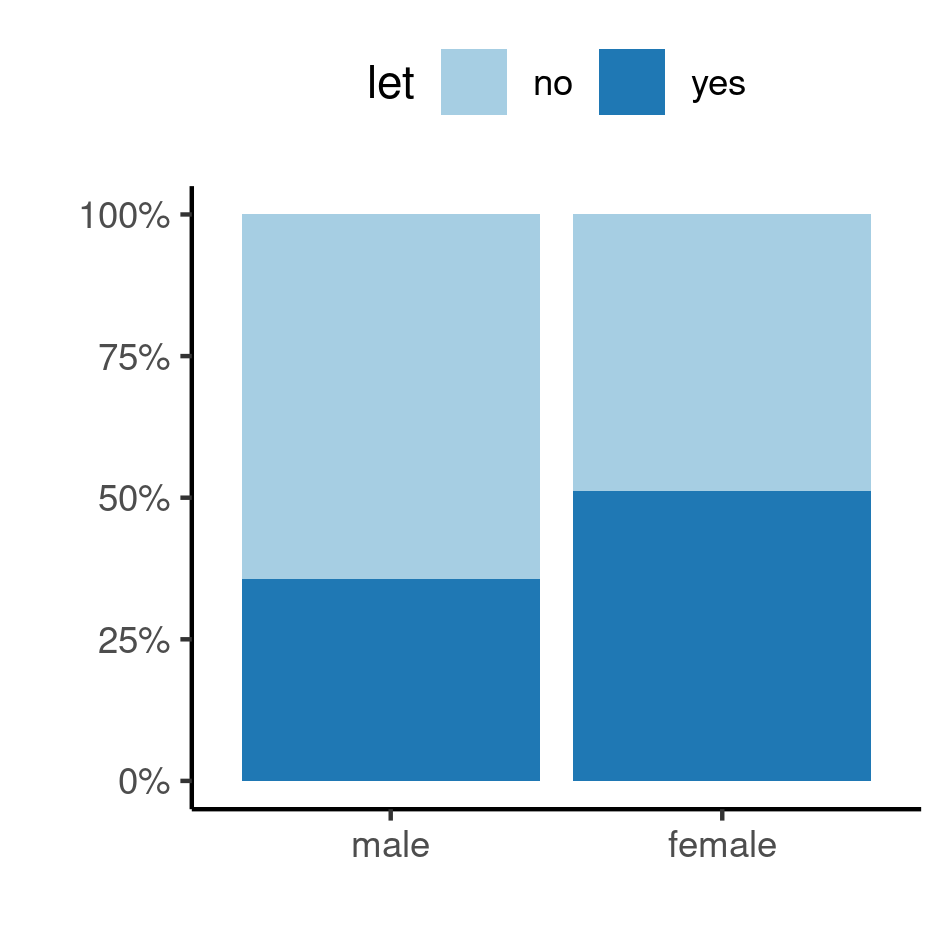
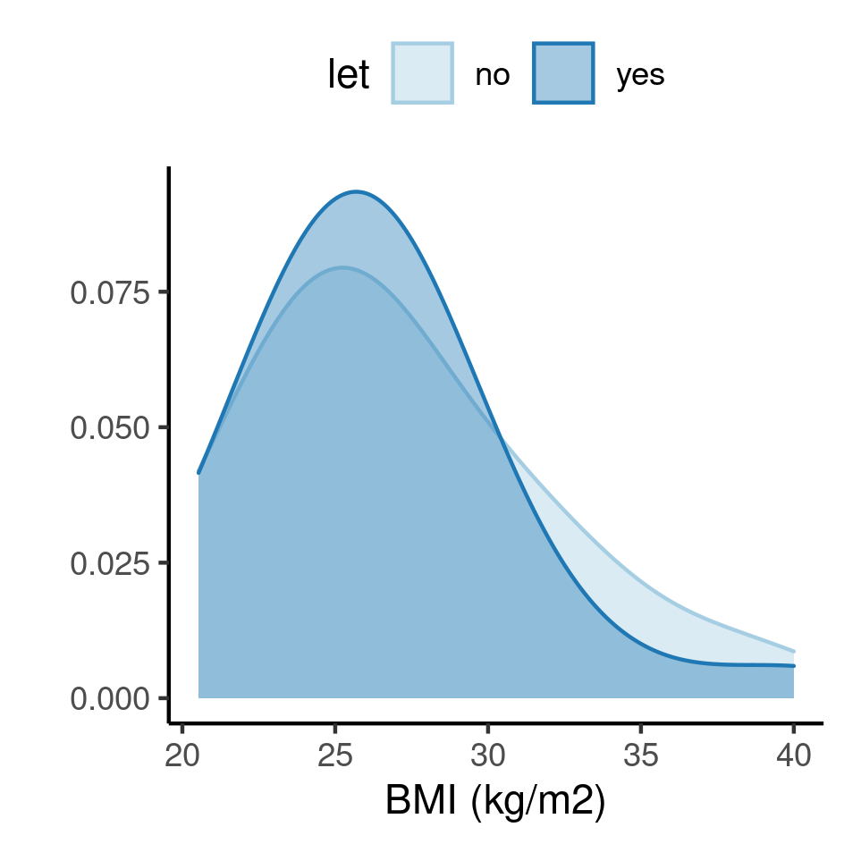
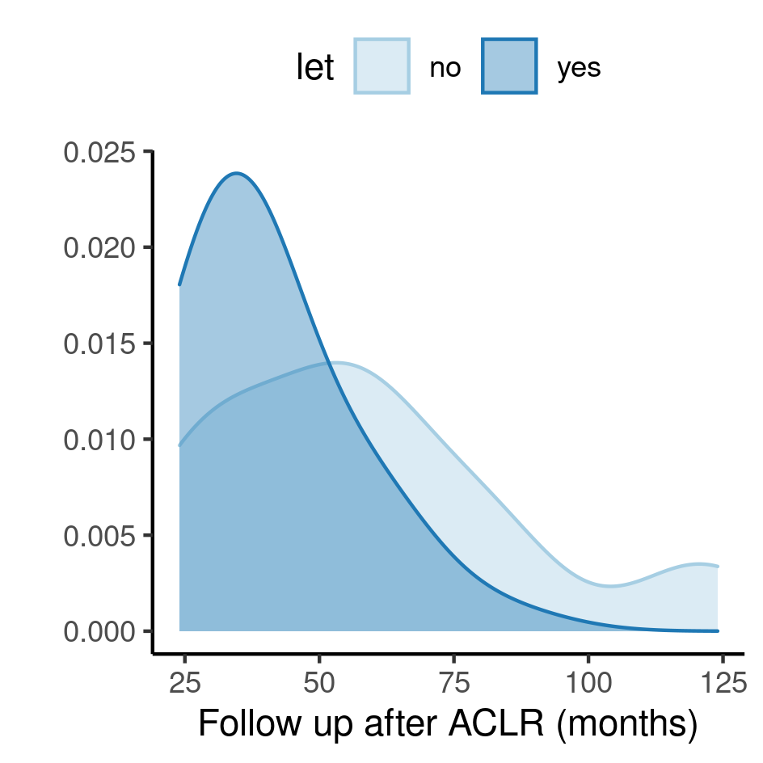

```{r setup, include=FALSE}
knitr::opts_chunk$set(echo = FALSE)
knitr::opts_knit$set(root.dir = normalizePath(".."))
options(scipen = 999)
library(pander)
library(knitr)
library(philsfmisc)
panderOptions('table.style', 'rmarkdown')
panderOptions('table.split.table', Inf)
```

---

**Document version**

```{r, echo = FALSE}
Version <- c("01", "02")
Changes <- c("Initial version",
             "Data: patient ages were computed from dates with calendar accuracy")
history <- cbind(Version, Changes)
colnames(history) <- c("Version", "Alterations")
# pander(history, split.cells = 70)
kable(history)
```

---

<!-- # Assinaturas -->

<!-- ```{r, echo=FALSE} -->
<!-- sig.field <- "__________________________" -->
<!-- date.field <- "_____________" -->
<!-- Stat <- c("Elaborador", "Nome", "Função", sig.field, date.field) -->
<!-- Reviewer <- c("Revisado por", "", "", sig.field, date.field) -->
<!-- Approver <- c("Verificado por", "", "", sig.field, date.field) -->
<!-- Final.Approver <- c("Aprovação final", "", "", sig.field, date.field) -->

<!-- sigs <- rbind( -->
<!--   Stat -->
<!--   , Reviewer -->
<!--   , Approver -->
<!--   , Final.Approver -->
<!--   ) -->
<!-- rownames(sigs) <- NULL -->
<!-- colnames(sigs) <- c("Papel", "Nome", "Função", "Assinatura", "Data") -->

<!-- # pander(sigs, split.cells = c(9, 14, 14, 16, 8), split.table = Inf) -->
<!-- kable(sigs) -->
<!-- ``` -->

```{r results, include=FALSE}
source("scripts/results.R", encoding = 'UTF-8')
```

# Abbreviations

- ACL: anterior cruciate ligament
- ACLR: ACL revision
- BMI: body mass index
- CI: Confidence Interval
- LCL: lateral collateral ligament
- LET: lateral extra-articular tenodesis
- MCL: medial collateral ligament
- MTPS: medial tibial posterior slope
- PCL: posterior cruciate ligament
- SD: standard deviation

# Introduction

## Context

## Objectives

Compare the baseline demographic and clinical characteristics of patients undergoing Anterior Cruciate Ligament Revision surgery whether or not they the Lateral Extra-articular Tenodesis technique was employed.

## Hypotheses

LET and no LET groups are comparable at baseline.

## Data reception and cleaning

In total there were 126 variables in the dataset received.
Variables in the raw data sheet were grouped into sections.
For this analysis only the baseline **demographic** characteristics and the variables in the **surgical data most recent revision ACLR** section were selected.

All variables in the analytical set were labeled according to the raw data provided and values were labeled according to the data dictionary for the preparation of production-quality results tables and figures.

After the cleaning process `r ncol(analytical)` variables were included in the analysis with `r nrow(analytical)` observations.
Table A1 shows the structure of the analytical dataset (section 8.3).
The data cleaning procedures employed are detailed in the analytical plan (**SAP-2021-004-TV-v01**).

# Methods

## Study Variables

### Primary and secondary outcomes

This analysis describes the epidemiological characteristics of surgical patients that undergone ACLR, and no endpoints were assessed.

### Covariates

The distribution of the characteristics were compared at baseline between the two study groups.
Variables to be considered for baseline comparison are:

- Age
- Sex
- BMI
- Graft diameter
- Medial meniscus
- Lateral meniscus
- Cartilage

## Statistical analyses

The epidemiological profile of each study group (LET and no LET) were described at baseline.
Demographic and clinical variables were described as mean and standard deviation or as counts and proportions, as appropriate.
Distributions were summarized in tables and visualized in exploratory plots.

All comparisons were performed as univariate analyses.
Continuous variables were compared between groups with the independent t test with Welch correction.
Difference in distribution of categorical variables were assessed with the Fisher exact test.
No adjustment for covariates were performed.

All analyses were performed using the significance level of 5%.
All significance hypothesis tests and confidence intervals computed were two-tailed.

### Statistical packages

This analysis was performed using statistical software `R` version `r getRversion()`.

# Results

## Study population and follow up

A total of 69 patients that undergone ACLR surgery were included in the study, where the LET technique was used in 31 patients and 38 acted as a control.
Ages varied between 14 and 55 years, with an average age of 27 years with an SD of 10 years.
There were 28 (41%) male patients and 41 (59%) female.
Patients had BMI values ranging from 20.5 to 40 kg/m2 with average BMI of 26.8 kg/m2 and median 26 kg/m2.

Primary ACL surgeries recorded occurred between 1984-01-01 and 2017-08-30, and ACL revisions occurred between 2010-03-09 and 2019-05-31.
Per patient time between the primary ACL and the most recent ACLR ranged from 33 weeks to 27 years, with an average followup time of 6.57 years between primary and last revision surgeries, and median time of 4.08 years between primary and last revision surgeries.

The follow up of patients after ACLR ranged from 2 years to 10.3 years, with an average follow up of 4.18 years and median 3.08 years.

The distributions of these variables can be seen in Figures A1 -- A5 (Section 8.1).

The epidemiological profile of the typical patient that required ACLR surgery was a 27 years female with an average BMI of 26.8 kg/m2.


## Surgical characteristics and baseline comparison

Patients included in the study required grafts with diameters ranging from 7.5 to 11 mm.
Average graft diameter used was 9.6 mm with an SD of 0.7 mm.
Most patients did not require procedures in the medial meniscus (48%), the lateral meniscus (58%) or in the cartilage (96%).
A total of 13 patients (19%) had partial resection in the medial meniscus, indicating a possibility of arthrosis in the knee joint, and 12 (17%) had partial resection in the lateral meniscus.

Most of the characteristics evaluated in this study did not indicate significant differences when using the LET procedure compared to not using it (Table 1).
Demographic and clinical characteristics had comparable distributions for
sex (p =	0.228),
age (Cohen's D = 0.26, 95% CI = -0.21, 0.74, p = 0.263) and
BMI (Cohen's D = 0.13, 95% CI = -0.40, 0.67, p =	0.619).
Surgical characteristics also had comparable distributions for
graft diameter (Cohen's D = 0.05, 95% CI = -0.42, 0.53, p =	0.818),
medial meniscus (p = 0.684),
lateral meniscus (p = 0.569),
cartilage (p = 0.498) and
MTPS (Cohens' D = 0.03, 95% CI = -0.44, 0.51, p = 0.886).
Follow up time was significantly lower for patients that had ACLR using the LET technique
(Cohen's D = 0.78, 95% CI = 0.29, 1.3, p = 0.001).

Table: **Table 1** Patient characteristics at baseline.  
n (%); Mean (SD);
d = Cohen's D;
CI = Confidence Interval;
p-value = Fisher's exact test; Welch Two Sample t-test.

```{r inf_baseline}
inf_baseline %>% as_kable(align = "lcccccc")
```

All of the observed Cohen's D standardized mean differences (Cohen, 1988) range from very small (d = 0.04) to medium (d = 0.78).
Note that the minimum effect size detectable by this study would be of a medium effect size (d = 0.68, see **SAP-2021-004-TV-v01**) or larger.

# Exceptions and Observations

Most characteristics evaluated here have similar statistical metrics, when observing the mean and the SD.
The exception is the follow up duration, where the LET group had a significantly lower average than the non LET group (Table 1, Figure A4).
As observed above there was an absolute mean difference of 18 months and a standardized mean difference d = 0.78.
To compare the dispersion between the groups we can observe that the LET group had a 36% coefficient of variation where the non LET group had a CV of 49%.

This means that even if the means were not as distant from each other, there is much more precision (less dispersion) in the measurement of follow up lengths for the LET group compared to the non LET group.
Hypotheses that could explain such a difference is that the LET group could have been followed up more carefully, or that the LET group did not require much post-operative attention.
In the first case there could be a bias towards the null and in the latter it could mean an improvement in surgical recuperation.
We recommend that this result be interpreted with caution.

# Conclusions

The epidemiological profile of the typical patient that required ACLR surgery was a 27 years female with an average BMI of 26.8 kg/m2.

Follow up time after ACLR was significantly lower for the LET group (p = 0.001, d = 0.78).
No other characteristics evaluated in this study indicated significant differences when using the LET procedure compared to not using it.
Patients had comparable distributions for demographic characteristics such as 
sex (p = 0.228),
age (p = 0.263, d = 0.26) and
BMI (p = 0.619, d = 0.13),
as well as surgical characteristics such as
graft diameter (p = 0.818, d = 0.05),
medial meniscus (p = 0.684),
lateral meniscus (p = 0.569),
cartilage (p = 0.498) and
medial tibial posterior slope	(p = 0.886).

Therefore, LET and no LET groups had comparable clinical characteristics at baseline.

# References

- **SAP-2021-004-TV-v01** -- Analytical Plan for Comparison of baseline characteristics of patients undergoing ACLR under the option of the LET surgical technique.
- Cohen, J. (1988). Statistical power analysis for the behavioral sciences (2nd Ed.). New York: Routledge.

# Appendix

## Exploratory data analysis

```{r A1, fig.cap="**Figure A1** Distribution of age in the study population, according to the study group."}
# 
knitr::include_graphics("../figures/distr_age.png", error = FALSE)
```

```{r A2, fig.cap="**Figure A2** Distribution of sex in the study population, according to the study group."}
# 
knitr::include_graphics("../figures/distr_sex.png", error = FALSE)
```

```{r, fig.cap="**Figure A3** Distribution of BMI in the study population, according to the study group."}
# 
knitr::include_graphics("../figures/distr_bmi.png", error = FALSE)
```

```{r, fig.cap="**Figure A4** Distribution of follow up time in the study population, according to the study group."}
# 
knitr::include_graphics("../figures/distr_fu.png", error = FALSE)
```

```{r, fig.cap="**Figure A5** Distribution of MTPS time in the study population, according to the study group."}
# 
knitr::include_graphics("../figures/distr_mtps.png", error = FALSE)
```


## Availability

This document can be downloaded in the following address:

`https://github.com/philsf-biostat/SAR-2021-004-TV/`

## Analytical dataset

Due to confidentiality the data-set used in this analysis cannot be shared online in the public version of this report.

```{r data}
# print analytical of analytical_mockup whether it is the private or public version of the SAR
# analytical %>%
#   pander(caption = "**Table A1** Analytical dataset")
analytical_mockup %>%
  pander(caption = "**Table A1** Analytical dataset structure")
```
